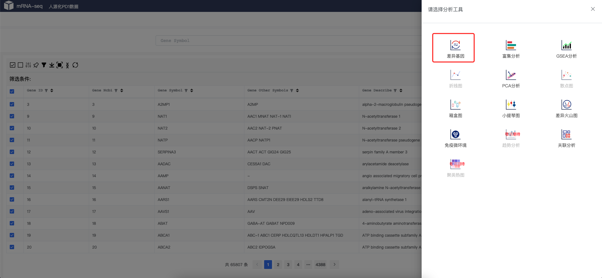
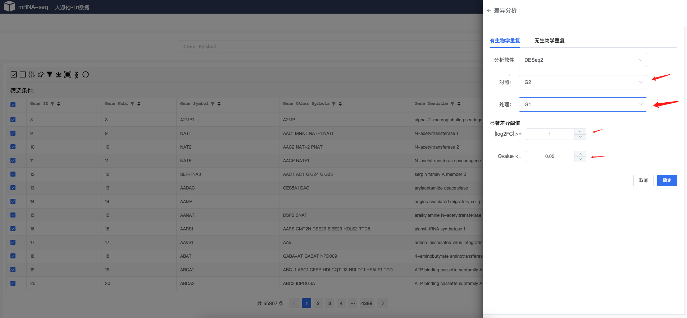
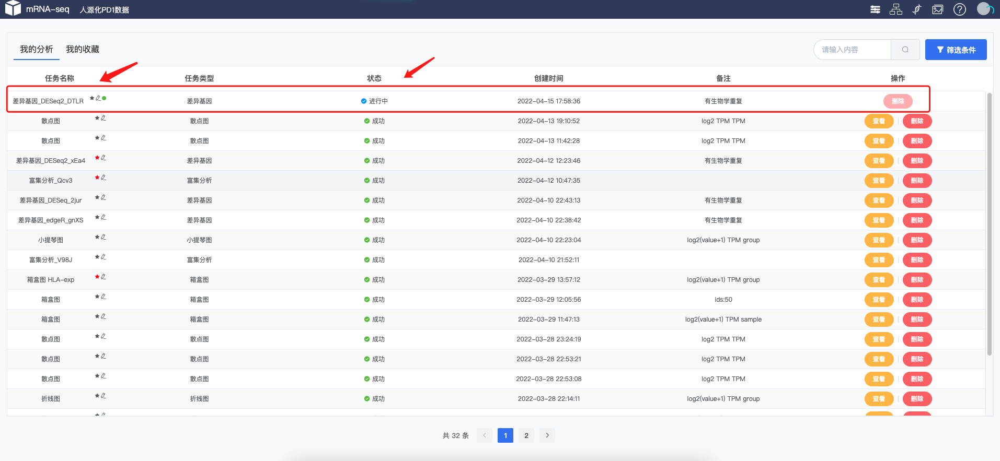
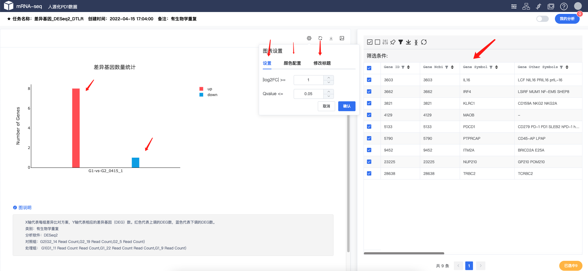

# 差异基因分析
差异基因分析
  
!!! note
    
    自定义选择分组、软件、参数进行差异基因分析。

### 数据选择

 
!!! note
    
    首页，或者任务任何选着工具的地方，都可以调出差异基因工具
### 工具选择

 
!!! note
    
    选择差异基因工具

### 选择参数

 
 
!!! note
    
    选择相应的参数，比如分组，foldchange Qvalue等。差异基因工具嵌套了不同的软件和算法，包括 `DESeq2`、`edgeR`、`DEseq`等，也可以在无重复样本情况下进行分析。

### 提交任务
 
 
!!! note
    
    进入任务列表，会显示相应提交的任务信息，等任务完成之后可以进行结果查看。
### 查看结果
 
!!! note
    
    差异基因工具会产生图标格式，左边一个📊 进行统计`上调`，`下调`结果统计，右边为差异结果基因。
    其实左边图片可以进行颜色、参数、和对应标题设置。右边表格可以进行`筛选`。如：`匹配相应基因`、`查看p-value`、`Q-value`、`log2FC`等。
    差异结果基因也可以调出任务工具进行相应的`KEGG`、`GSEA`、`火山图`等使用。

!!! tip "使用技巧"
    
    - 差异基因结果表格可以保存基因集，保存的基因集可以多次快速调度相应的工具。
    - 差异基因结果图可以临时更改 Q-value的值进行临时调差异基因的多少。
    - 差异基因结果图可以临时标题、颜色、值大小进行 图库保存。可在图库里面进行查看、下载、合并图片。