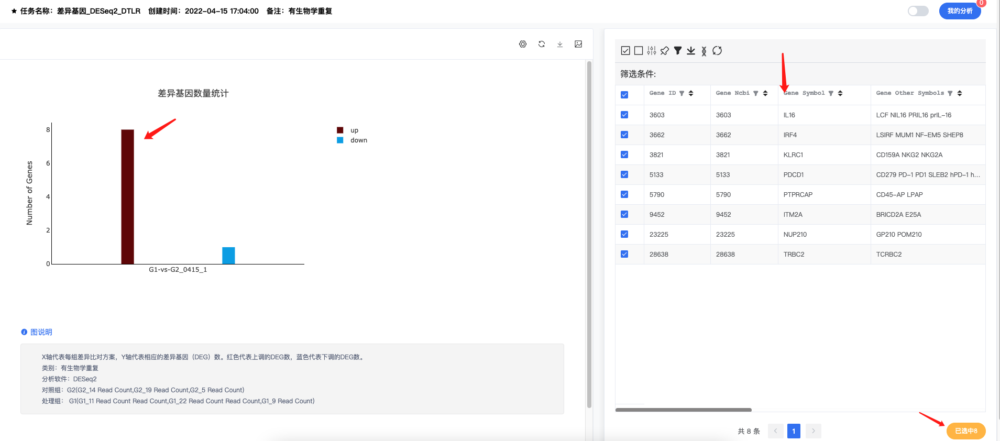
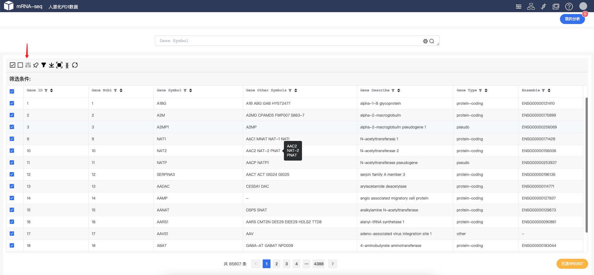
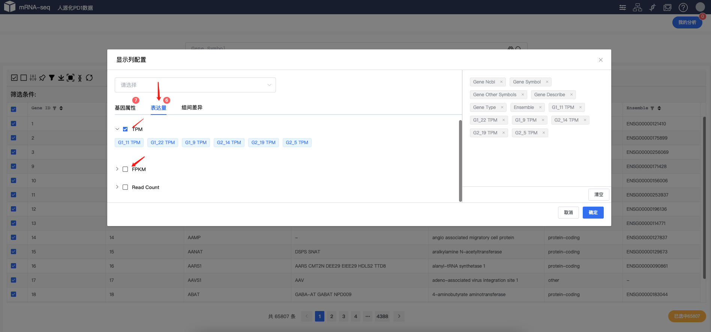
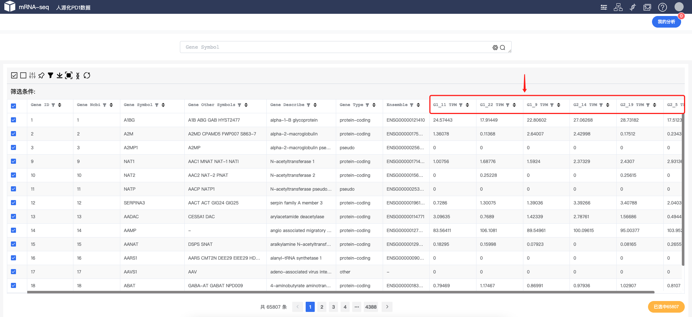
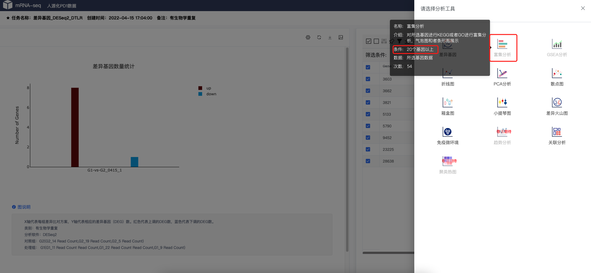
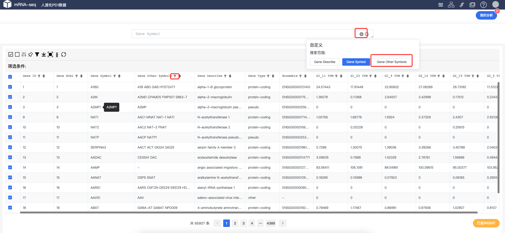

# FAQ
-  是否可以只进行上调基因进行KEGG、GO注释？
  
!!! tip "answer"

    可以的，两种方法
    1. 在差异分析结果中点击柱状图Up 显示相应的上调基因的结果，反之下调基因如此。  
    如下图：
    
    2. 也可以在主表中进行数据筛选

-  是否可以显示每条数据TMP/FPKM信息？
   
!!! Note "answer"

    可以的，系统中`每一处`，记住`每一处`表格均可以显示相应的配置。  
    如下图：
    
    
    

- 为什么有的工具显示`灰色`，不能点击？

!!! tip "answer"

    每个工具均有使用规则，`鼠标`放上之后，会有相应的显示注释  
    如下图：
    

-  是否搜索基因`别名` & `alias`？
   
!!! Note "answer"

    可以的，系统主页上方 或者表格中`过滤`按钮均可以实现  
    如下图：
    
