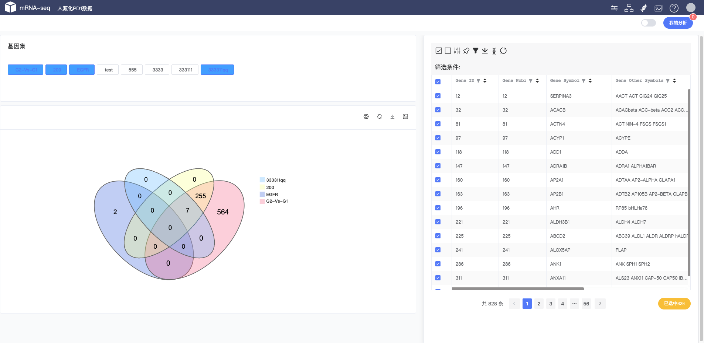

# mRNA-seq™ 分析系统
### 项目管理
项目管理模块，一个账号可以导入多个独立项目。可以在项目管理界面随意切换项目。  

    

### 图库
保存各个任务产生的结果，提供下载、合并下载、比较等功能。

    

  

#### 1.下载

    

 
!!!tip "提示"

    支持批量下载，选中要下载的图片进行批量下载，下载文件均为SVG矢量图

#### 2.对比查看

    

 

!!!tip "提示"

    选择多个图片进行查看

#### 3.合并图片

    

 

!!!tip "提示"

    合并图片选择2个或者多个图片进行合并，合并成功之后进行下载、查看

### 基因集
通过筛选、差异基因等方法可以保存基因集进行，查看、留存、以及再调工具。基因集模块可以查看不同基因集的交、并、差等集合，并以韦恩图的形势展示、下载。

    

 

!!!tip "提示"

    每个数据表格均有可以保存基因集的按钮。都可以存储所筛选的基因集。

### 分组
通过自定义分组实现再差异基因分析、聚类分析等工具中进行灵活选择参数。
通过筛选、差异基因等方法可以保存基因集进行，查看、留存、以及再调工具。基因集模块可以查看不同基因集的交、并、差等集合，并以韦恩图的形势展示、下载。

    

 

!!!tip "提示"

    自定义分组，可以剔除聚类或者测序不好的数据，进行再差异基因分析、等各个工具使用。具体选项参照工具列表。
