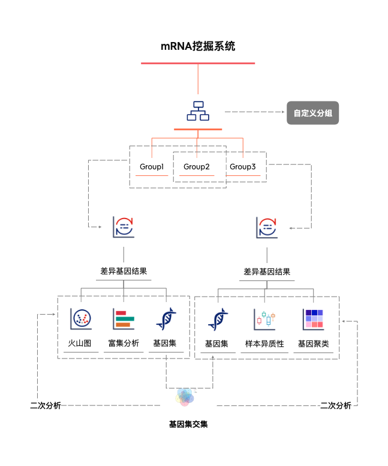

# 分析流程demo
分析流程demo

1. 数据分组  自定义分组 分组名称+选择样本
2. 筛选数据   选择自己想看得基因
3. 工具选择 ，差异基因
4. KEGG/GO注释
5. 不同分组差异基因- 保存基因集
6. 基因集 交集基因+KEGG、GO、GSEA
7. 选择基因 样本异质性分析
8. 样本关联系行聚类

!!! tip "使用技巧"
    
    - 每个任务结果表格中均可以进行数据筛选。
    - 每个任务结果表格`右下角`均可以进行工具调度。
    - 每个任务结果图可以临时标题、颜色、值大小进行 图库保存。可在图库里面进行查看、下载、合并图片。