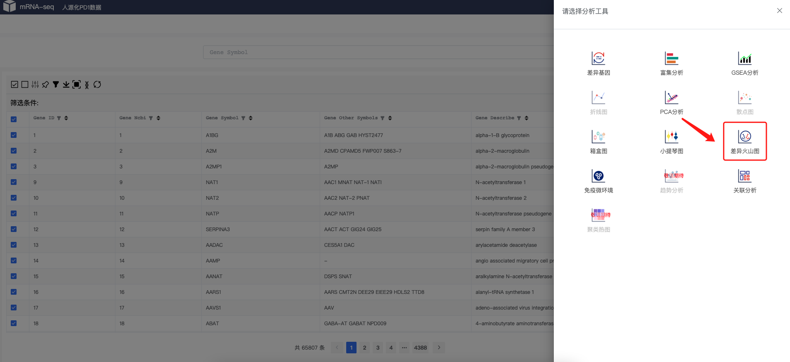
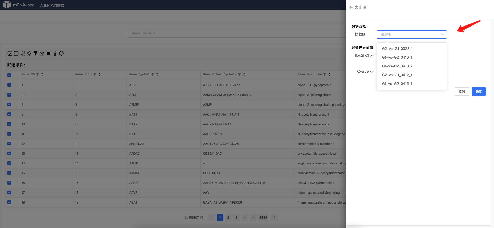
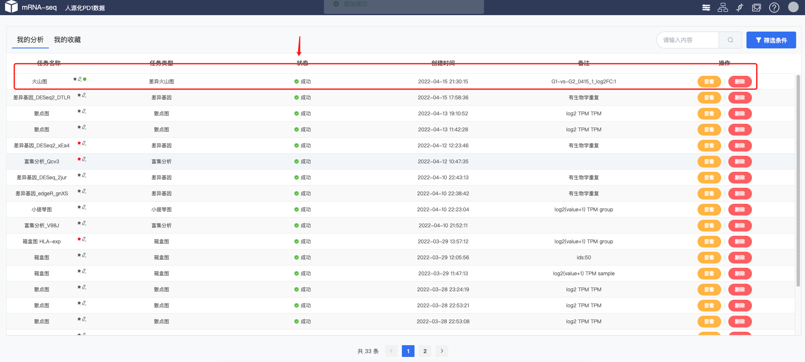
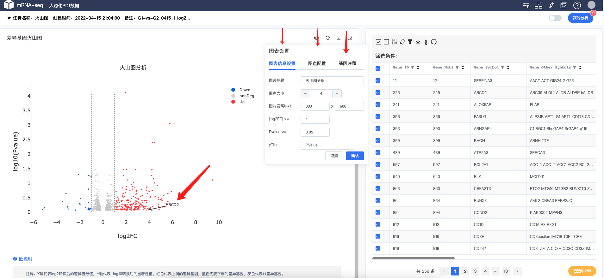

# 差异火山图
差异火山图
  
!!! note
    
    根据差异基因分析结果，可视化差异分析，工具可以自定义颜色、点大小、Qvalue选择、log2FC选择、基因注释等功能。工具可以自定义颜色、字体、图片大小等。

### 数据选择

 
!!! note
    
    首页，或者任务任何选着工具的地方，都可以调出火山图工具
### 工具选择

 
!!! note
    
    选择差异火山图工具

### 选择参数

 
 
!!! note
    
    选择相应的参数，比如分组，foldchange Qvalue等。选择相应的差异基因分析的结果分组。

### 提交任务
 
 
!!! note
    
    进入任务列表，会显示相应提交的任务信息，等任务完成之后可以进行结果查看。
### 查看结果
 
!!! note
    
    差异火山图结果为散点火山图，左边为图形格式，右边为相应的表格工具。每个火山图图形中有相应的配置，可以设置`图片标题`、`散点大小`、`图片高宽`、`log2FC`、`P-value & Q-value`、`散点颜色`、`基因注释`等
    右边表格中可以对相应的数据进行筛选、查询等

!!! tip "使用技巧"
    
    - 差异火山图结果表格可以保存基因集，保存的基因集可以多次快速调度相应的工具。
    - 差异火山图结果图可以临时更改 Q-value的值进行临时调差异基因的多少。
    - 差异火山图结果图可以临时标题、颜色、值大小进行 图库保存。可在图库里面进行查看、下载、合并图片。
    - `差异火山图结果中可以对上调 或者 下调基因等进行注释显示 如上图`