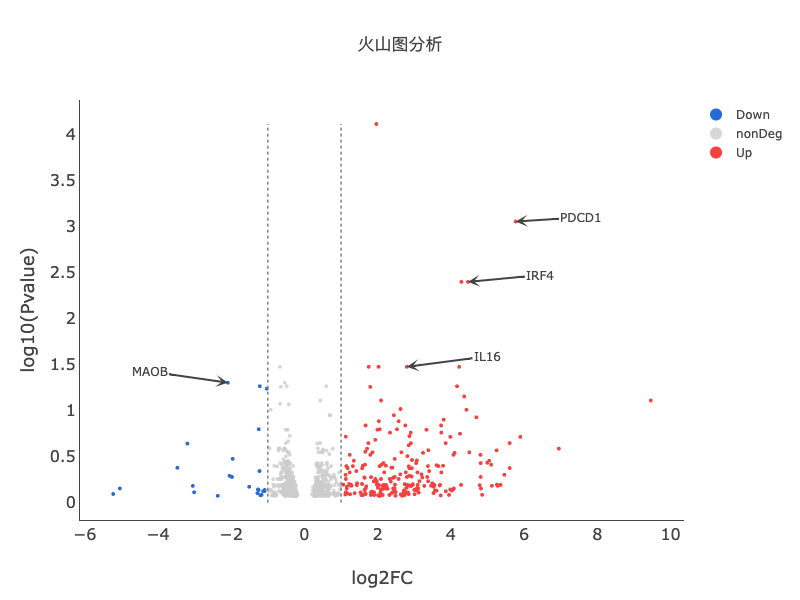
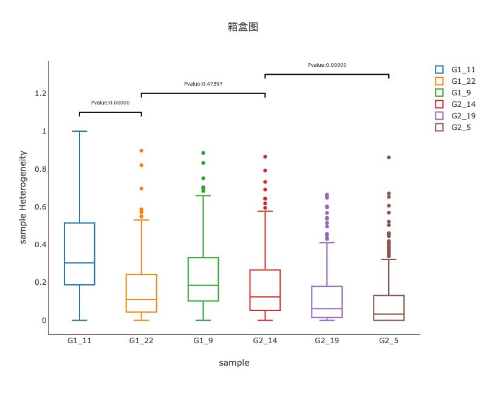

# 新颖
-  差异火山图`注释`基因名称

  
!!! tip "answer"

    
    详见`火山图`工具

-  箱盒图/小提琴图 显示`p-value`  

  
!!! tip "answer"

    
    详见`箱盒图`/`小提琴`图工具  
    检验方法：`T-test`、`Mann-Whitney` `U rank test`、`Kruskal-Wallis` `H-test`、`Levene test` 可自由选择

-  `免疫`微环境  

   
!!! tip "answer"

    详见`免疫微环境`图工具  
    检验方法：`TIMER`、`xCell`、`Epic`、`quanTIseq`、`CIBERSORT` 可自由选择